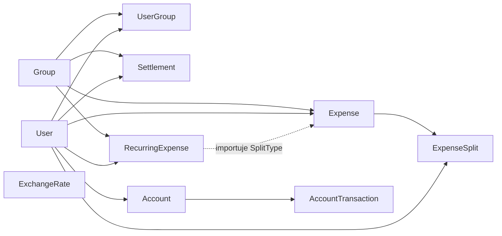

# Zadanie 1 — Case Study: ocena długu technologicznego i diagnoza "Big Ball of Mud"

> Krytyczna ocena projektu **Smart Expense Buddy** pod kątem długu technologicznego
> oraz weryfikacja, czy system zmierza w stronę antywzorca *Big Ball of Mud* (BBoM).

## 1.1 Cel

1. Zinwentaryzować moduły backendu i frontendu.
2. Wskazać symptomy długu technologicznego i powiązać je z konkretnymi miejscami w kodzie.
3. Ocenić, czy projekt jest już "Wielką Kulą Błota", czy ma tylko pojedyncze zapowiedzi tego antywzorca.

## 1.2 Krótka charakterystyka projektu

**Smart Expense Buddy** to webowa aplikacja do wspólnego rozliczania wydatków
w grupach z funkcjami:

- rejestracja / logowanie (JWT),
- grupy, członkowie, role (admin / member),
- wydatki z czterema rodzajami podziału (equal / exact / percent / shares),
- bilans grupy i sugerowane minimalne przelewy,
- rozliczenia (settle up),
- wydatki cykliczne (weekly / monthly / yearly),
- konwerter walut (NBP, cache Redis → DB → API),
- powiadomienia w czasie rzeczywistym (WebSocket),
- konta osobiste i transakcje (income / expense).

### Stack i topologia (z `docker-compose.yml`)

- **Backend:** Python, FastAPI, SQLAlchemy async, APScheduler (in-process), httpx.
- **Frontend:** React + TypeScript (Vite), Tailwind, React Query, WebSocket.
- **Persistencja:** PostgreSQL.
- **Cache / pub-sub:** Redis.
- **Integracje zewnętrzne:** API NBP.

### Struktura backendu (`backend/app/`)

```text
api/        # auth, groups, expenses, settlements, currency, recurring, ws, accounts
crud/       # operacje DB (group, expense, settlement, recurring_expense, crud_account, user)
db/models/  # user, group + user_group, expense + expense_split, settlement,
            # recurring_expense, account, transaction, exchange_rate
schemas/    # Pydantic DTO
services/   # split_calculator, settlement_engine, currency_service,
            # scheduler, notification_manager
core/       # config, security (JWT, hashing)
```

## 1.3 Metoda audytu

Dla każdego pliku w `backend/app/` i `frontend/src/` zadano trzy pytania:

1. Do której **funkcjonalności biznesowej** należy?
2. Z jakimi innymi modułami **dzieli model danych** lub **importuje** je bezpośrednio?
3. Czy logika biznesowa znajduje się w warstwie, w której powinna (model / serwis / API)?

Następnie wynik zestawiono z listą symptomów BBoM
(brak granic, "god classes", wszystko-zna-wszystko, duplikacja, brak języka domenowego,
bezpośredni dostęp do bazy między modułami, wycieki implementacji).

## 1.4 Diagnoza — symptomy długu technologicznego

| # | Symptom                                                                                                              | Lokalizacja w kodzie                                                                                              | Konsekwencja                                                                                       |
| --- | -------------------------------------------------------------------------------------------------------------------- | ----------------------------------------------------------------------------------------------------------------- | -------------------------------------------------------------------------------------------------- |
| 1 | Wyciek modelu między obszarami — `RecurringExpense` importuje `SplitType` z `Expense`                                 | `backend/app/db/models/recurring_expense.py` → `from app.db.models.expense import SplitType`                       | Recurring nie może ewoluować niezależnie od Expense                                                |
| 2 | Scheduler omija agregat `Expense` — sam wstawia `ExpenseSplit` i **ignoruje** `split_type` z szablonu (zawsze equal)  | `backend/app/services/scheduler.py` linie 48–68 (gałąź `else` w if/else nadal woła `calculate_equal_split`)        | Cicha zmiana semantyki: użytkownik definiuje percent / shares, system tworzy equal                  |
| 3 | Jeden globalny model `User` używany przez wszystkie obszary (Identity, Group, Expense, Settlement, Account)           | `db/models/user.py` + relacje w `expense.py`, `settlement.py`, `account.py`, `recurring_expense.py`, `group.py`     | Brak warstwy antykorupcyjnej — zmiana w auth wpływa na całą domenę                                  |
| 4 | Autoryzacja zaszyta w każdym endpoincie (`_require_membership`, ręczne `membership.role == ADMIN`)                    | `api/expenses.py`, `api/groups.py`, `api/settlements.py`, `api/recurring.py`                                       | Duplikacja, ryzyko niespójnej polityki przy zmianach                                                |
| 5 | Dwa różne pojęcia "transakcji": `AccountTransaction` (rachunek osobisty) oraz przelew w `Settlement` / `SuggestedTransfer` | `db/models/transaction.py` vs `db/models/settlement.py` + `services/settlement_engine.py`                          | Brak jednoznacznego języka — łatwo pomylić koncepty                                                  |
| 6 | `ExpenseSplit.owed_amount` nie ma waluty — domyślnie "taka sama jak Expense.currency"                                 | `db/models/expense.py`                                                                                            | Bilanse mieszają waluty bez konwersji w `compute_balances`                                          |
| 7 | Globalny singleton `manager` z `services/notification_manager.py` importowany w API i schedulerze                     | `api/expenses.py`, `services/scheduler.py`, `api/ws.py`                                                            | Sprzężenie domeny z transportem (WS); brak warstwy zdarzeń domenowych                                |
| 8 | Mieszana konwencja nazw plików w `crud/` — `crud_account.py` vs `account.py`, `expense.py`, `group.py`                | `backend/app/crud/`                                                                                                | Drobny dług, ale wprowadza nieczytelność                                                            |
| 9 | Wspólna `BaseModel` i jeden schemat Postgresa dla wszystkich tabel                                                    | `backend/app/db/base.py`, `db/models/__init__.py`                                                                  | Fizyczne sprzężenie kontekstów na poziomie schematu                                                  |
| 10 | CORS dopuszcza tylko `http://localhost:5173`, ale aplikacja w `docker-compose` działa na `:3000` (nginx)              | `backend/main.py` linie 42–48                                                                                      | Dług konfiguracyjny / niespójność środowisk                                                          |
| 11 | `compute_balances` traktuje wszystkie wydatki jak tę samą walutę                                                      | `backend/app/services/settlement_engine.py` linie 28–43                                                            | Niepoprawne wyniki w grupach wielowalutowych                                                         |
| 12 | Scheduler trzymany w procesie API (`AsyncIOScheduler` w `lifespan`)                                                   | `backend/main.py` linie 19–33                                                                                      | Skalowanie poziome backendu = wielokrotne uruchomienia tego samego joba                              |
| 13 | Logika domenowa rozsiana między `api/*.py` i `services/*.py` zamiast siedzieć w agregacie                              | np. budowa `Expense + ExpenseSplit` w `crud/expense.py` i ponownie w `services/scheduler.py`                       | Brak pojedynczego, autorytatywnego miejsca, gdzie żyje inwariant biznesowy                            |

### Mini-mapa zależności między modelami (As-Is)



Strzałka kropkowana `Rec -. importuje SplitType .-> Exp` to **konkretny wyciek**
między modułami (punkt 1 tabeli).

## 1.5 Werdykt — czy to BBoM?

**Nie, ale projekt jest na wczesnym etapie dryfu w tym kierunku.**

Pozytywne:

- Jest podział na warstwy `api/`, `crud/`, `services/`, `db/models/`, `schemas/`.
- W `services/` są wydzielone czyste moduły obliczeniowe (`split_calculator`,
  `settlement_engine`) — to dobry zaczątek logiki domenowej.

Negatywne (zarazem zapowiedzi BBoM):

- Brak **jawnych granic** między obszarami biznesowymi.
- Logika rozsmarowana między `api/`, `crud/`, `services/`, schedulerem.
- Wycieki modeli (punkt 1), pominięcia agregatu (punkt 2), globalny stan (punkt 7).
- Wspólny model `User` jako "klej" wszystkich obszarów.

Jeżeli kolejne funkcje (np. powiadomienia push, eksport bankowy) zostaną dorzucone
w tej samej konwencji, system w 1–2 iteracjach stanie się BBoM.

## 1.6 Lista długów do spłaty (priorytety)

1. **P0 — błąd semantyczny:** scheduler ignoruje `split_type` z szablonu (#2).
2. **P0 — błąd merytoryczny:** bilanse ignorują walutę (#6, #11).
3. **P1 — granice:** wprowadzić moduły per kontekst i wydzielić zdarzenia domenowe (#3, #7, #13).
4. **P1 — autoryzacja:** wspólny `Depends(require_group_role(...))` zamiast kopii w endpointach (#4).
5. **P2 — nazewnictwo:** ujednolicić nazewnictwo w `crud/` (#8), zredefiniować "transakcję" (#5).
6. **P2 — operacyjne:** wynieść scheduler z procesu API (#12), poprawić CORS dla `:3000` (#10).

