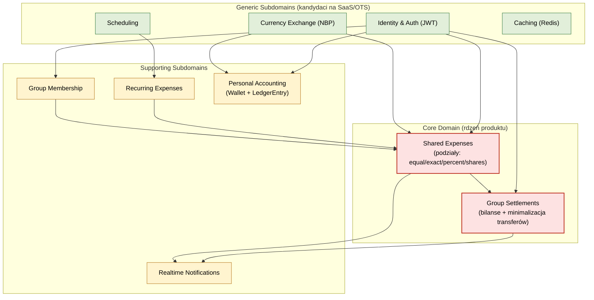

# Zadanie 2 — Identyfikacja subdomen (Core / Supporting / Generic)

> Dekompozycja domeny biznesowej **Smart Expense Buddy** na trzy klasyczne typy subdomen DDD.

## 2.1 Cel

Wskazać, co w systemie jest:

- **Core Domain** — przewaga konkurencyjna, własne algorytmy, "dlaczego użytkownik wybiera tę aplikację".
- **Supporting Subdomain** — istotne dla produktu, ale nie unikalne (warto napisać samemu, ale rzadko da się kupić gotowca 1:1).
- **Generic Subdomain** — można podmienić na gotowe rozwiązanie / SaaS bez utraty wartości.

## 2.2 Metoda klasyfikacji

Dla każdej funkcjonalności z README oraz dla każdego modułu w kodzie pada pytanie:

1. **Czy to jest "to, po co istnieje produkt"?** → Core.
2. **Czy to coś, czego nie da się łatwo zastąpić, ale samo z siebie nie jest powodem wyboru produktu?** → Supporting.
3. **Czy w internecie jest 5 dojrzałych implementacji tego, i każda z nich załatwia sprawę?** → Generic.

## 2.3 Klasyfikacja subdomen Smart Expense Buddy

| Funkcjonalność / moduł kodu                                                                                                                | Typ            | Uzasadnienie                                                                                                                |
| ------------------------------------------------------------------------------------------------------------------------------------------ | -------------- | --------------------------------------------------------------------------------------------------------------------------- |
| Algorytmy podziału wydatków: `services/split_calculator.py` + agregat `Expense` (`db/models/expense.py`)                                    | **Core**       | Główna wartość: equal / exact / percent / shares + poprawne zaokrąglenia                                                     |
| Bilanse grupy i minimalizacja liczby przelewów: `services/settlement_engine.py`, `db/models/settlement.py`                                  | **Core**       | Algorytm greedy minimalizujący liczbę przelewów — wyróżnik produktu                                                          |
| Grupy i członkostwo: `db/models/group.py`, `api/groups.py`                                                                                  | **Supporting** | Bez grup nie ma core, ale to standardowy CRUD członkostwa                                                                    |
| Wydatki cykliczne: `db/models/recurring_expense.py`, `services/scheduler.py`, `api/recurring.py`                                            | **Supporting** | Zasila Core (Expense), ale sama z siebie nie tworzy unikalnej wartości                                                       |
| Konta osobiste i transakcje: `db/models/account.py`, `db/models/transaction.py`, `api/accounts.py`                                          | **Supporting** | Mini-budżetowanie obok rdzenia — wspiera użytkownika, ale rdzeniem są wydatki współdzielone                                  |
| Powiadomienia real-time: `services/notification_manager.py`, `api/ws.py`                                                                    | **Supporting** | Poprawiają UX, ale można je zastąpić innym mechanizmem (SSE, push)                                                            |
| Uwierzytelnianie i JWT: `api/auth.py`, `core/security.py`, `db/models/user.py`                                                              | **Generic**    | Standard branżowy — Auth0, Keycloak, AWS Cognito, Supabase Auth                                                              |
| Konwersja walut: `services/currency_service.py`, `db/models/exchange_rate.py`, `api/currency.py`                                            | **Generic**    | NBP / Fixer.io / Open Exchange Rates / ECB — wymienne                                                                        |
| Scheduling: `AsyncIOScheduler` w `main.py`                                                                                                  | **Generic**    | Celery beat / k8s CronJob / Temporal / GitHub Actions cron — wymienne                                                        |
| Cache: Redis (`docker-compose.yml`)                                                                                                         | **Generic**    | Każda implementacja Redis-kompatybilna lub Memcached                                                                          |

## 2.4 Mapa subdomen

## 2.5 Implikacje dla decyzji "build vs buy"

| Obszar                      | Decyzja sugerowana                | Uzasadnienie                                                            |
| --------------------------- | --------------------------------- | ----------------------------------------------------------------------- |
| Core (podziały, bilanse)    | **Build**, inwestować w jakość    | To wyróżnik produktu — testy, czytelny model, profilowanie wydajności    |
| Supporting                  | **Build**, ale prosto             | Standardowe rozwiązania, bez nadmiernej abstrakcji                       |
| Generic — Auth              | **Buy** (np. Keycloak / Supabase) | Bezpieczeństwo, MFA, OAuth — to lepiej zrobione "na zewnątrz"            |
| Generic — Currency          | **Buy / pośrednik**               | NBP teraz, ale przez ACL — żeby łatwo zmienić providera                  |
| Generic — Scheduling        | **Buy** (Celery / Temporal / k8s) | Skalowalność, retry, observability                                       |
| Generic — Cache             | **Buy** (Redis managed)           | Standard, łatwo zastąpić                                                  |

