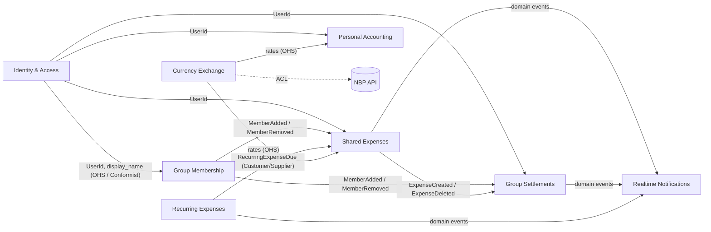

# Zadanie 3 — Bounded Contexts, Język Wszechobecny i Context Map

> Projektowanie granic semantycznych dla **Smart Expense Buddy**:
> wyznaczenie Bounded Contexts, ustalenie spójnego słowniczka pojęć dla każdego
> z nich oraz wyeliminowanie wieloznaczności z dotychczasowego kodu.

## 3.1 Wyznaczone Bounded Contexts (stan To-Be)

| # | Bounded Context              | Typ subdomeny  | Agregat (Aggregate Root) | Co publikuje                                        | Co konsumuje                                    |
| - | ---------------------------- | -------------- | ------------------------ | --------------------------------------------------- | ----------------------------------------------- |
| 1 | **Identity & Access (IAM)**  | Generic        | `UserAccount`            | `UserRegistered`, `UserDeactivated`                 | —                                                |
| 2 | **Group Membership**         | Supporting     | `Group` (z `Membership`) | `MemberAdded`, `MemberRemoved`, `GroupArchived`     | `UserRegistered`                                 |
| 3 | **Shared Expenses** (Core)   | Core           | `Expense` (z `Split`)    | `ExpenseCreated`, `ExpenseDeleted`                  | `MemberAdded/Removed`, `RecurringExpenseDue`     |
| 4 | **Group Settlements** (Core) | Core           | `Settlement`, `GroupBalance` (read-model) | `SettlementRecorded`, `BalanceRecomputed` | `ExpenseCreated/Deleted`, `SettlementRecorded`   |
| 5 | **Recurring Expenses**       | Supporting     | `RecurringTemplate`      | `RecurringExpenseDue`                               | tick z Schedulera                                |
| 6 | **Personal Accounting**      | Supporting     | `Wallet` (z `LedgerEntry`) | `LedgerEntryAdded`                                | `UserRegistered`                                 |
| 7 | **Currency Exchange**        | Generic        | `ExchangeRate`           | `RateRefreshed`                                     | NBP (przez ACL)                                  |
| 8 | **Realtime Notifications**   | Supporting     | — (brak agregatu)        | —                                                   | wszystkie zdarzenia domenowe pozostałych BC      |

## 3.2 Eliminacja wieloznaczności (As-Is → To-Be)

| As-Is (obecny kod)                                 | Problem                                                                                       | To-Be (po renamingu)                                |
| -------------------------------------------------- | --------------------------------------------------------------------------------------------- | --------------------------------------------------- |
| `User` (`db/models/user.py`)                       | Słowo "user" jest w każdym kontekście. W IAM oznacza tożsamość; w grupach — członka.           | W IAM: `UserAccount`; w innych BC: tylko `UserId`    |
| `Account` (`db/models/account.py`) — rachunek osobisty | Konflikt z "kontem" w IAM (konto użytkownika)                                              | **`Wallet`** (`FinancialAccount` też do przyjęcia)   |
| `AccountTransaction` (`db/models/transaction.py`)  | Słowo "transaction" jest wieloznaczne (vs. settlement transfers)                              | **`LedgerEntry`** (z polami `direction: Income/Outflow`) |
| `Settlement` + `SuggestedTransfer`                 | Dwie nazwy dla rozliczeń: utrwalony przelew (DB) vs. propozycja algorytmu                      | `Settlement` (utrwalone) + `SuggestedTransfer` (przejściowy DTO) — **bez zmian**, ale jasny opis |
| `Expense` (`db/models/expense.py`)                 | "Expense" w Shared Expenses = współdzielony wydatek; w Personal Accounting = wpis ujemny       | W PA słowo *expense* zostaje wewnątrz `LedgerEntry` jako *outflow*; w SE pozostaje `Expense` |
| `SplitType` (`db/models/expense.py`)               | Wartość biznesowa rdzenia importowana z innego modułu (`RecurringExpense`)                     | `SplitType` żyje wyłącznie w **Shared Expenses**; Recurring trzyma własny `SplitTypePolicy` lub publikuje string |
| `transaction` (potoczne w UI / WS)                 | Mieszanie pojęcia "operacji na portfelu" i "przelewu rozliczeniowego"                          | UI: w sekcji rozliczeń słowo *transfer*; w portfelach — *entry*                                 |

## 3.3 Context Map

Legenda relacji DDD:

- **OHS** — *Open Host Service* (publiczny, stabilny kontrakt).
- **Conformist** — strona po prawej akceptuje kontrakt strony po lewej, bez tłumaczenia.
- **ACL** — *Anti-Corruption Layer* (warstwa antykorupcyjna, izoluje od obcego modelu).
- **Customer / Supplier** — relacja z negocjowanym kontraktem.

## 3.4 Słowniki języka wszechobecnego (Ubiquitous Language)

### 3.4.1 Identity & Access (IAM)

| Termin         | Znaczenie w tym kontekście                                                                       |
| -------------- | ------------------------------------------------------------------------------------------------ |
| `UserAccount`  | Tożsamość uwierzytelniona w systemie (e-mail + hasło)                                            |
| `Credentials`  | Para e-mail + hasło                                                                              |
| `AccessToken`  | JWT podpisany sekretem aplikacji                                                                 |
| `AuthSession`  | Logiczna sesja użytkownika ważna do `exp` tokenu                                                 |

### 3.4.2 Group Membership

| Termin         | Znaczenie                                                                          |
| -------------- | ---------------------------------------------------------------------------------- |
| `Group`        | Zbiór osób dzielących wydatki                                                       |
| `Member`       | `UserId` przypisany do `Group`                                                      |
| `Membership`   | Wiązanie `UserId` ↔ `GroupId` z rolą                                                |
| `Role`         | `Admin` (zarządza) lub `Member` (zwykły uczestnik)                                  |
| `Invitation`   | (przyszłość) zaproszenie do grupy                                                   |

### 3.4.3 Shared Expenses (Core)

| Termin         | Znaczenie                                                                          |
| -------------- | ---------------------------------------------------------------------------------- |
| `Expense`      | Pojedynczy zarejestrowany wydatek w grupie                                          |
| `Payer`        | `UserId`, który zapłacił                                                            |
| `Participant`  | `UserId`, który uczestniczy w podziale                                              |
| `SplitType`    | `equal` / `exact` / `percent` / `shares`                                            |
| `Split`        | Element `Expense`: ile dany Participant jest winien                                 |
| `OwedAmount`   | Kwota w walucie `Expense.currency` (planowana zmiana: jawnie z `currency`)          |
| `ExpenseDate`  | Data księgowa wydatku                                                               |

### 3.4.4 Group Settlements (Core)

| Termin             | Znaczenie                                                                                                 |
| ------------------ | --------------------------------------------------------------------------------------------------------- |
| `Balance`          | Saldo netto `UserId` w danej `Group`: dodatnie = inni winni mu, ujemne = on jest winny                     |
| `Creditor`         | `UserId` z dodatnim saldem                                                                                 |
| `Debtor`           | `UserId` z ujemnym saldem                                                                                  |
| `SuggestedTransfer` | DTO algorytmu: `(from_user, to_user, amount)` — sugestia do wykonania                                     |
| `Settlement`       | Zapisany w bazie fakt: dłużnik zapłacił wierzycielowi określoną kwotę                                      |
| `SettleUp`         | Akcja użytkownika "rozlicz się" — tworzy `Settlement`                                                      |

### 3.4.5 Recurring Expenses

| Termin                | Znaczenie                                                                              |
| --------------------- | -------------------------------------------------------------------------------------- |
| `RecurringTemplate`   | Szablon, z którego generowane są realne `Expense`                                        |
| `Interval`            | `weekly` / `monthly` / `yearly`                                                          |
| `DayOfMonth`          | Dzień miesiąca dla intervalu `monthly`                                                   |
| `NextRun`             | Data kolejnego uruchomienia szablonu                                                     |
| `GenerationRun`       | Pojedyncze "wykonanie" szablonu w danym dniu                                              |
| `RecurringExpenseDue` | Zdarzenie publikowane gdy `NextRun <= today` — konsumowane przez Shared Expenses          |

### 3.4.6 Personal Accounting

| Termin            | Znaczenie                                                                               |
| ----------------- | --------------------------------------------------------------------------------------- |
| `Wallet`          | Osobisty rachunek użytkownika (Cash / Card / Savings) — rename z `Account`               |
| `LedgerEntry`     | Wpis do portfela (rename z `AccountTransaction`)                                         |
| `Direction`       | `Income` / `Outflow` (kierunek wpisu)                                                    |
| `WalletBalance`   | Suma wszystkich `LedgerEntry` w portfelu                                                  |
| `WalletType`      | `Cash` / `Debit Card` / `Credit Card` / `Savings`                                         |

### 3.4.7 Currency Exchange

| Termin            | Znaczenie                                                                  |
| ----------------- | -------------------------------------------------------------------------- |
| `Rate`            | Kurs przeliczeniowy z `BaseCurrency` na `TargetCurrency` w danym `RateDate` |
| `RateDate`        | Data, na którą obowiązuje kurs                                              |
| `Provider`        | Źródło danych (obecnie: NBP)                                                |
| `Conversion`      | Operacja: kwota × `Rate`                                                    |

### 3.4.8 Realtime Notifications

| Termin            | Znaczenie                                                                  |
| ----------------- | -------------------------------------------------------------------------- |
| `Channel`         | Kanał WebSocket dla danej `GroupId`                                         |
| `Subscriber`      | Aktywne połączenie WS należące do konkretnego `UserId`                      |
| `Event`           | Wiadomość JSON publikowana do `Channel`                                     |
| `EventEnvelope`   | Standardowy kształt: `{ "type": ..., ... }`                                  |

## 3.5 Jak to mapuje się na obecny kod

| Bounded Context        | Pliki obecnie (As-Is)                                                                                              | Sugerowany pakiet docelowy (To-Be)         |
| ---------------------- | ------------------------------------------------------------------------------------------------------------------ | ------------------------------------------ |
| Identity & Access      | `api/auth.py`, `api/deps.py`, `core/security.py`, `db/models/user.py`, `crud/user.py`, `schemas/user.py`           | `app/contexts/iam/`                        |
| Group Membership       | `api/groups.py`, `db/models/group.py`, `crud/group.py`, `schemas/group.py`                                          | `app/contexts/groups/`                     |
| Shared Expenses        | `api/expenses.py`, `db/models/expense.py`, `crud/expense.py`, `schemas/expense.py`, `services/split_calculator.py` | `app/contexts/shared_expenses/`            |
| Group Settlements      | `api/settlements.py`, `db/models/settlement.py`, `crud/settlement.py`, `schemas/settlement.py`, `services/settlement_engine.py` | `app/contexts/settlements/`     |
| Recurring Expenses     | `api/recurring.py`, `db/models/recurring_expense.py`, `crud/recurring_expense.py`, `schemas/recurring_expense.py`, `services/scheduler.py` | `app/contexts/recurring/`     |
| Personal Accounting    | `api/accounts.py`, `db/models/account.py`, `db/models/transaction.py`, `crud/crud_account.py`, `schemas/account.py` | `app/contexts/personal_accounting/`        |
| Currency Exchange      | `api/currency.py`, `db/models/exchange_rate.py`, `services/currency_service.py`, `schemas/currency.py`              | `app/contexts/currency/`                   |
| Realtime Notifications | `api/ws.py`, `services/notification_manager.py`                                                                     | `app/contexts/notifications/`              |

