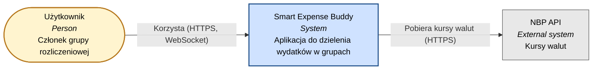
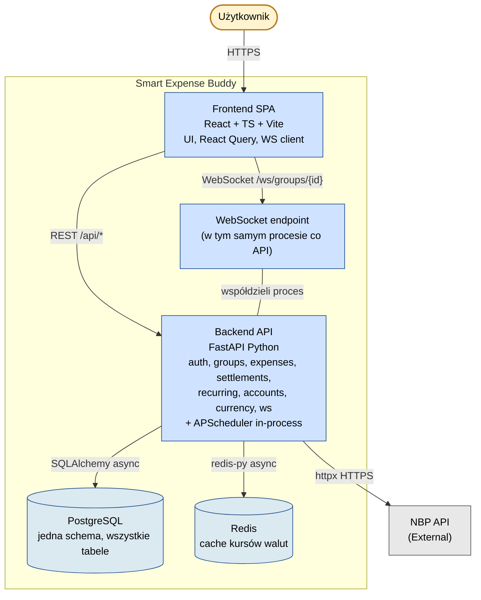
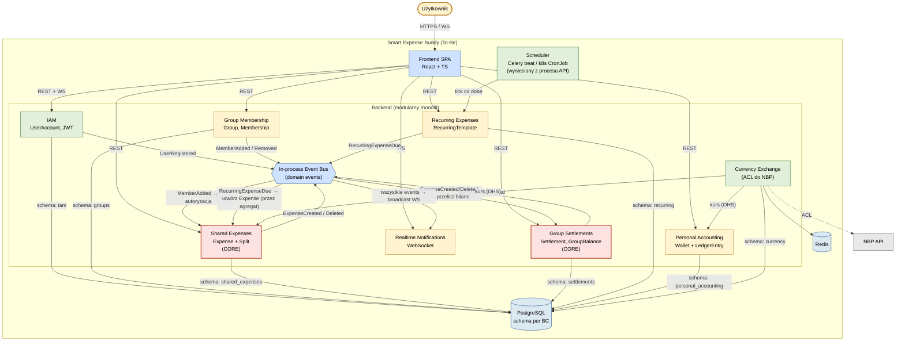

# Zadanie 4 — Model C4: stan obecny (As-Is) i docelowy (To-Be)

> Architektura systemu **Smart Expense Buddy** w notacji C4 (poziomy: Context i Container).
> Wariant As-Is = jak wygląda dzisiaj. Wariant To-Be = jak powinien wyglądać po
> wprowadzeniu Bounded Contexts z `03-bounded-contexts.md`.

> Uwaga techniczna: zamiast `C4Context` / `C4Container` z Mermaida (które bywają zawodne
> w niektórych rendererach, m.in. przy przecinkach i nawiasach w opisach), używam tu
> `flowchart` z `subgraph` i klasami stylów. To jest powszechnie stosowane
> zastępstwo, w pełni zgodne z duchem C4 (kontener / system / aktor / relacja).

## 4.1 C4 Level 1 — System Context (wspólny dla As-Is i To-Be)

**Komentarz.** Z perspektywy świata zewnętrznego system widać jako jedną całość;
jedyne dwie istotne relacje to: użytkownik → system (UI po HTTPS i WS),
system → NBP (pobieranie kursów).

## 4.2 C4 Level 2 — Container, **As-Is**

Tu pokazana jest dzisiejsza topologia: monolit FastAPI z wszystkimi obszarami
biznesowymi w jednym procesie i jednej bazie.

**Komentarz do As-Is.**

- Całość API to **jeden monolit** — wszystkie obszary biznesowe (auth, grupy,
  wydatki, rozliczenia, recurring, konta osobiste, waluty, WS) żyją w tym samym
  procesie i tej samej bazie.
- **Scheduler** (APScheduler) jest częścią procesu API → przy poziomym skalowaniu
  utworzy się N kopii joba.
- **WebSocket** = osobny endpoint, ale w tym samym procesie; broadcast realizuje
  globalny singleton `notification_manager.manager` importowany przez `api/*` i scheduler.
- Brak jawnych granic między obszarami biznesowymi — wszystko może wszystkiego użyć
  (i tak właśnie się dzieje, patrz wycieki opisane w `01-case-study.md`).

## 4.3 C4 Level 2 — Container, **To-Be**

Wariant docelowy: **modularny monolit** z jawnymi Bounded Contexts jako modułami
wewnątrz tego samego procesu. Komunikacja między BC odbywa się przez **wewnętrzną
szynę zdarzeń** (in-process), a nie przez bezpośrednie importy klas między modułami.
Scheduler wyniesiony z procesu API. Schemat bazy podzielony per kontekst (PostgreSQL,
ale różne schemy lub odrębne tabele z jasnym właścicielem).

**Komentarz do To-Be — co się zmienia względem As-Is:**

1. **Jawne moduły per Bounded Context** w jednym backendzie (modularny monolit).
   To pozwala później wyodrębnić mikroserwisy bez przepisywania domeny.
2. **In-process Event Bus** rozplątuje sprzężenia: `Recurring → Shared Expenses → Settlements`
   nie odbywa się już przez bezpośrednie importy klas SQLAlchemy.
3. **Scheduler poza procesem API** — można skalować backend horyzontalnie.
4. **ACL na granicy z NBP** — `Currency Exchange` izoluje resztę systemu od konwencji NBP
   ("rate X → PLN") i pozwala wymienić providera.
5. **Schema bazy per BC** — fizycznie wciąż jedna baza, ale jasny właściciel każdej tabeli.
6. **WebSocket** staje się czystym konsumentem zdarzeń, a nie globalnym singletonem
   wstrzykiwanym do API.

## 4.4 Roadmap przejścia As-Is → To-Be

| Krok | Działanie                                                                                              | Wpływa na                                                  |
| ---- | ------------------------------------------------------------------------------------------------------ | ---------------------------------------------------------- |
| 1    | Utworzyć katalogi `app/contexts/<bc>/` i przenieść do nich obecne `api/`, `crud/`, `models/`, `schemas/` | wszystkie BC (czysta reorganizacja, bez zmian logiki)      |
| 2    | Zlikwidować import `SplitType` z `RecurringExpense` — własny enum w Recurring lub przekazywanie stringa | Shared Expenses ↔ Recurring                                |
| 3    | Wprowadzić mały `EventBus` (in-process, async) i zacząć od jednego eventu: `ExpenseCreated`            | Shared Expenses, Settlements, Notifications                |
| 4    | Przepisać scheduler na publikację `RecurringExpenseDue`; konsument w Shared Expenses tworzy `Expense` przez agregat | Recurring, Shared Expenses                                 |
| 5    | Zamienić ręczne sprawdzenia uprawnień w endpointach na wspólny `Depends(require_group_role(...))`      | Group Membership, Shared Expenses, Settlements, Recurring  |
| 6    | Dodać walutę do `ExpenseSplit.owed_amount` i przejść w `compute_balances` na waluty per uczestnik       | Shared Expenses, Settlements, Currency Exchange            |
| 7    | Zmienić nazwy: `Account → Wallet`, `AccountTransaction → LedgerEntry` (migracja + DTO + UI)             | Personal Accounting                                        |
| 8    | Wynieść scheduler do osobnego procesu (Celery beat / k8s CronJob)                                       | Recurring, infrastruktura                                  |
| 9    | Podzielić bazę na schemy per BC (`iam`, `groups`, `shared_expenses`, ...)                               | wszystkie BC                                               |
| 10   | Zaktualizować CORS na port `:3000` (lub konfigurowalny przez env)                                        | infrastruktura                                              |

